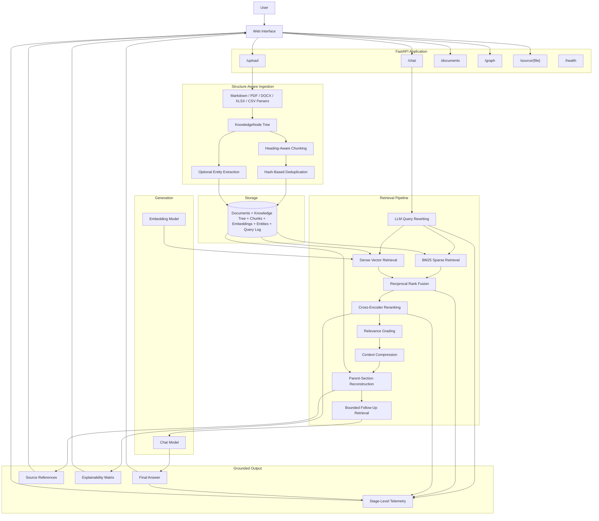
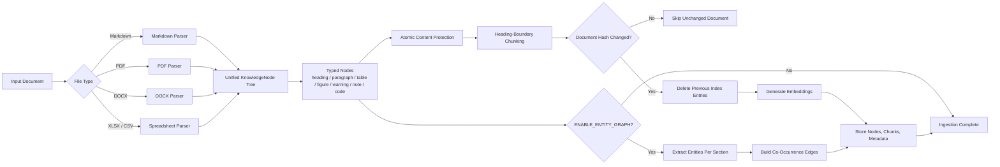
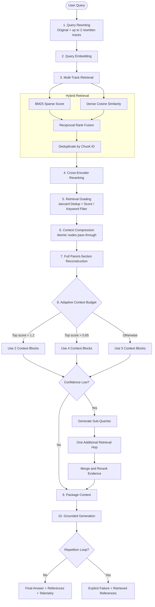
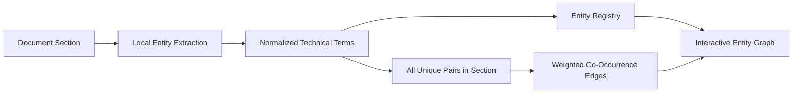

<div align="center">

# EvidenceRAG

### Structure-Aware Hybrid RAG for Technical Document Intelligence

An explainable document question-answering system that parses technical documents into a hierarchical structure, retrieves evidence with a hybrid BM25 + dense pipeline, and refuses to fabricate an answer when the evidence doesn't support one.

<br>

[](https://www.python.org/)
[](https://fastapi.tiangolo.com/)
[](#architecture)

</div>

---

## Table of Contents

- [Overview](#overview)
- [What Makes EvidenceRAG Different](#what-makes-evidencerag-different)
- [Design Philosophy](#design-philosophy)
- [System Architecture](#system-architecture)
- [Document Ingestion Pipeline](#document-ingestion-pipeline)
- [RAG Query Flow](#rag-query-flow)
- [Explainability and Observability](#explainability-and-observability)
- [Entity Graph](#entity-graph)
- [Evaluation Results](#evaluation-results)
- [Technology Stack](#technology-stack)
- [Project Structure](#project-structure)
- [Quick Start](#quick-start)
- [Architecture](#architecture)
- [Current Limitations](#current-limitations)

---

## Overview

EvidenceRAG is a document intelligence system built for technical, industrial, and engineering documents — the kind where a sentence taken out of context ("apply after 600 hours") is worse than no answer at all.

It answers questions using content from Markdown, PDF, Word, Excel, and CSV files. Documents are not treated as a bag of unrelated text fragments: every parser produces a hierarchical `KnowledgeNode` tree containing headings, paragraphs, tables, figures, warnings, notes, and code blocks, and that tree is the source of truth for retrieval, not a flat chunk list.

Retrieval combines:

- LLM-based query rewriting
- BM25 sparse retrieval
- Dense vector similarity
- Reciprocal Rank Fusion
- Cross-encoder reranking
- Retrieval grading
- Full parent-section reconstruction
- One bounded follow-up retrieval hop
- Grounded answer generation
- Source-level explainability
- Stage-level latency telemetry

---

## What Makes EvidenceRAG Different

| Typical Tutorial RAG | EvidenceRAG |
|:--|:--|
| Fixed-size flat chunks | Hierarchical `KnowledgeNode` tree |
| Dense retrieval only | BM25 + dense retrieval + RRF |
| Raw Top-K results | Cross-encoder reranking |
| Always trusts retrieved chunks | Relevance grading and deduplication |
| Matched excerpt in isolation | Full parent-section reconstruction |
| Single retrieval pass | One bounded follow-up retrieval hop |
| Tables treated as plain text | Tables and figures preserved atomically |
| Re-embeds everything | Hash-based incremental ingestion |
| Hidden retrieval process | Explainability matrix and telemetry |
| Silent model degeneration | Repetition-loop detection |
| No relationship layer | Entity co-occurrence graph |

---

## Design Philosophy

### Node tree, not chunk-first

Chunking is a view over the document tree, not the primary representation. This makes parent-section reconstruction, atomic table/figure handling, section-aware metadata, and entity extraction possible without format-specific retrieval logic.

### Bounded, not open-ended

The follow-up retrieval hop is capped at one additional round, triggered by a cheap score threshold rather than another LLM call asking "is this enough?" — adaptivity without an open-ended agent loop or unpredictable latency.

### Fail honestly, never fabricate

There are no hardcoded fallback answers. When retrieval is insufficient or generation degenerates, the system returns an explicit failure state and keeps the retrieved references visible.

### Measure before optimizing

A telemetry layer records stage-level latency for every query, so bottlenecks are found by looking at numbers, not by guessing.

---

## System Architecture



---

## Document Ingestion Pipeline



### Parser contract

Every parser returns the same conceptual structure:

```text
KnowledgeNode
├── node_id
├── document_id
├── parent_id
├── node_type
├── heading_path
├── content
├── page_number
├── metadata
└── children
```

This shared structure prevents downstream retrieval logic from depending on file format.

---

## RAG Query Flow



### Hybrid retrieval

| Signal | Strength |
|:--|:--|
| BM25 | Exact terminology, model numbers, error codes, product names |
| Dense similarity | Paraphrases, semantic similarity, conceptual matches |
| Reciprocal Rank Fusion | Combines both rankings without requiring score normalization |
| Cross-encoder | Evaluates query-document relevance jointly |

### Bounded adaptive retrieval

```text
Maximum retrieval depth = initial retrieval + one follow-up hop
```

Triggered by a confidence threshold, never an open-ended reasoning loop.

### Full parent-section reconstruction

A retrieved node is expanded with its sibling nodes from the same parent section, so an instruction like "apply after 600 operating hours" reaches the model together with what it applies to and which component it concerns.

### Honest failure handling

If generation fails or enters a repetition pattern, the system returns an explicit failure message, the retrieved source references, and the available telemetry — never a fabricated replacement answer.

---

## Explainability and Observability

### Explainability matrix fields

| Field | Purpose |
|:--|:--|
| Query track | Which rewritten query found the evidence |
| Source file | The original document |
| Page number | Direct verification |
| Node type | Paragraph, table, warning, figure, etc. |
| Heading path | Document hierarchy |
| BM25 score | Lexical relevance |
| Dense score | Semantic similarity |
| Fusion rank | RRF result |
| Rerank score | Cross-encoder relevance |
| Selected context | Whether the item reached generation |
| Retrieval hop | Initial vs. follow-up retrieval |

### Pipeline telemetry fields

| Stage | Recorded Information |
|:--|:--|
| Query expansion | Generated query tracks and latency |
| Embedding | Embedding model and latency |
| Hybrid retrieval | Candidate count and retrieval latency |
| Reranking | Candidate scores and reranking latency |
| Grading | Removed and retained candidates |
| Compression | Context reduction and parent expansion |
| Follow-up retrieval | Trigger state and hop count |
| Generation | Model, duration, and failure state |
| Faithfulness scoring | LLM-as-judge score (0-1) and any unsupported claims, skipped when generation failed |

---

## Entity Graph

EvidenceRAG can extract technical entities from each document section and build co-occurrence edges.



It currently supports document exploration, concept discovery, section-level relationship inspection, and explainability. It is not currently used as an additional retrieval signal.

---

## Evaluation Results

The retrieval pipeline is evaluated against a naive dense-retrieval baseline on the same labeled dataset (`docs/eval_set.json`), Top-5 setting, source-file-level ground truth.

| Pipeline | Precision@5 | Recall@5 | MRR |
|:--|--:|--:|--:|
| Naive dense retrieval | 0.857 | 0.857 | 0.857 |
| **Advanced pipeline** | **0.893** | **1.000** | **0.905** |

| Metric | Improvement |
|:--|--:|
| Precision@5 | +4.2% |
| Recall@5 | +16.7% |
| MRR | +5.6% |

Alongside retrieval quality, every query response is also scored for **answer faithfulness**: a second, cheap Gemini call acts as an LLM-as-judge, given the generated answer and the exact chunks it was allowed to use, and returns a 0-1 support score plus a list of any unsupported claims (see `src/evaluation/judge.py`). This catches the case retrieval metrics can't: the right document was found, but the answer still hallucinated or misstated what it says. Scores are logged per-query via `telemetry.py` and averaged across the eval set in `docs/eval_report.md`.

Full detail: [`docs/eval_report.md`](./docs/eval_report.md).

---

## Technology Stack

| Layer | Technology |
|:--|:--|
| Backend | Python, FastAPI, Uvicorn |
| Chat model | Gemini (`gemini-2.5-flash`) |
| Embeddings | Gemini (`gemini-embedding-001`) |
| Sparse retrieval | `rank-bm25` |
| Fusion | Reciprocal Rank Fusion |
| Reranking | `bge-reranker-base` |
| PDF parsing | pdfplumber |
| DOCX parsing | python-docx |
| Spreadsheet parsing | pandas |
| Graph visualization | Vis Network |
| Evaluation | Precision@K, Recall@K, MRR, Faithfulness (LLM-as-judge) |

---

## Project Structure

```
├── server/
│   ├── api/app.py                 FastAPI app: routes only, pure JSON API
│   ├── src/
│   │   ├── config.py               Central config, reads .env, STORAGE_MODE switch
│   │   ├── llm.py                  Gemini chat generation + embeddings
│   │   ├── query_pipeline.py       Orchestrates expansion -> retrieval -> [follow-up hop] -> generation
│   │   ├── graph.py                Entity extraction + co-occurrence graph building
│   │   ├── telemetry.py            Persistent structured query logging
│   │   ├── storage/
│   │   │   ├── database.py           knowledge_nodes, document_chunks, documents
│   │   │   │                         registry, entities/entity_edges (SQLite
│   │   │   │                         locally, Postgres+pgvector on Supabase)
│   │   │   └── files.py               Raw file storage: local disk or Supabase Storage
│   │   ├── ingestion/
│   │   │   ├── pipeline.py            Shared parse -> chunk -> embed -> store pipeline
│   │   │   ├── chunking.py            chunk_nodes() (tree-aware) + chunk_document() (legacy)
│   │   │   └── parsers/               Pluggable document parsers, all tree-aware
│   │   ├── retrieval/
│   │   │   ├── hybrid.py              BM25 + dense fusion (RRF), cached index
│   │   │   ├── reranker.py            Cross-encoder re-ranking
│   │   │   ├── grader.py              Retrieval relevance grading + Jaccard dedup
│   │   │   ├── query_rewriter.py      LLM-based query expansion + sub-query decomposition
│   │   │   └── compression.py         Sentence-window pruning + parent-section reconstruction
│   │   └── evaluation/
│   │       └── judge.py               Answer faithfulness scoring (LLM-as-judge)
│   ├── scripts/
│   │   ├── ingest.py               Parse + chunk + embed + index, with hash-based dedup
│   │   ├── run_eval.py             Precision/Recall/MRR + faithfulness benchmark harness
│   │   ├── test_connection.py      Quick Gemini API connectivity check
│   │   └── supabase_schema.sql     One-time Postgres+pgvector schema for Supabase mode
│   └── requirements.txt
├── web/                            Next.js frontend (shadcn/ui), talks to the server as an API
└── docs/
    ├── sample_docs/                 Example knowledge base (multi-format)
    ├── eval_set.json                Labeled Q&A pairs for benchmarking
    └── eval_report.md               Latest benchmark results
```

---

## Quick Start

### Set up the server

```bash
cd server
python -m venv .venv
source .venv/bin/activate      # Windows: .venv\Scripts\activate
pip install -r requirements.txt
cp .env.example .env
```

Configure `.env` (defaults to local storage):

```env
STORAGE_MODE=local
GEMINI_API_KEY=your-key-here
ENABLE_ENTITY_GRAPH=false
```

### Ingest documents

```bash
python scripts/ingest.py
```

### Run the application

```bash
uvicorn api.app:app --reload
```

The server is a pure JSON API (no bundled UI) — FastAPI's interactive docs are at `http://127.0.0.1:8000/docs`. Point the `web/` frontend at this API once it exists.

---

## Architecture

Chat generation and embeddings run through the Gemini API (requires `GEMINI_API_KEY`); reranking uses a local BGE cross-encoder.

Parsing, `KnowledgeNode` tree construction, entity graph, cross-encoder reranking, retrieval grading, parent-section reconstruction, and bounded follow-up retrieval are identical regardless of where storage runs. The storage layer is swappable behind `STORAGE_MODE` for a stateless, deployable configuration.

---

## Current Limitations

- The entity graph is currently an exploration and explainability layer, not a retrieval signal.
- Entity extraction performs one LLM call per document section and can be expensive for large documents.
- Local generation latency depends on hardware, context size, and model selection.
- Faithfulness scoring adds one extra LLM call per query (skipped when generation itself already failed) and is judged by the same model family doing the generation, not an independent/stronger judge model.

