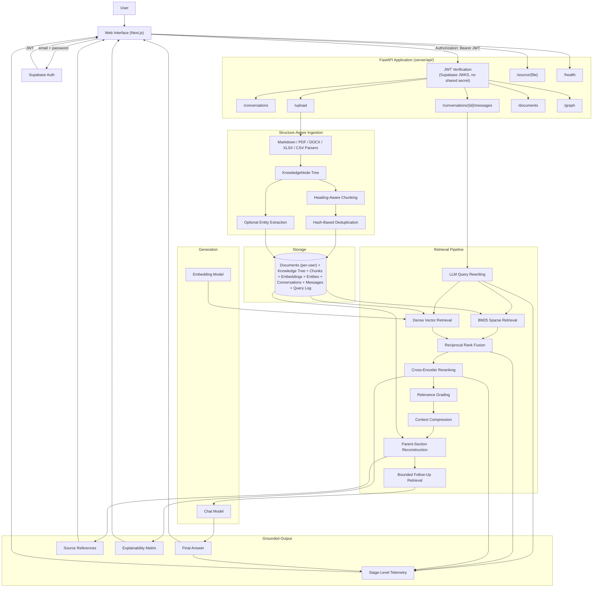
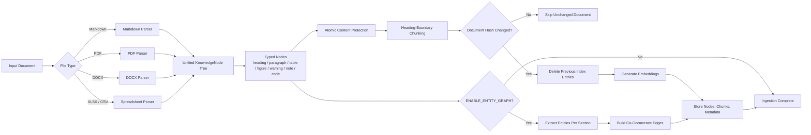
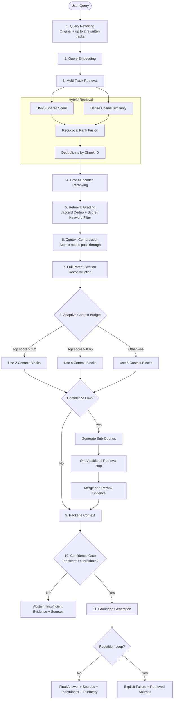
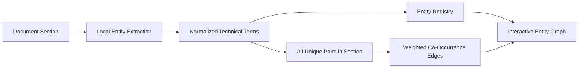

<div align="center">

# EvidenceRAG

### Structure-Aware Hybrid RAG for Technical Document Intelligence

An explainable document question-answering system that parses technical documents into a hierarchical structure, retrieves evidence with a hybrid BM25 + dense pipeline, and refuses to fabricate an answer when the evidence doesn't support one.

<br>

[](https://www.python.org/)
[](https://fastapi.tiangolo.com/)
[](https://nextjs.org/)
[](#architecture)
[](#authentication--conversations)

</div>

---

## Table of Contents

- [Overview](#overview)
- [What Makes EvidenceRAG Different](#what-makes-evidencerag-different)
- [Design Philosophy](#design-philosophy)
- [System Architecture](#system-architecture)
- [Document Ingestion Pipeline](#document-ingestion-pipeline)
- [RAG Query Flow](#rag-query-flow)
- [Authentication & Conversations](#authentication--conversations)
- [Explainability and Observability](#explainability-and-observability)
- [Entity Graph](#entity-graph)
- [Evaluation Results](#evaluation-results)
- [Technology Stack](#technology-stack)
- [Project Structure](#project-structure)
- [Quick Start](#quick-start)
- [Architecture](#architecture)
- [Current Limitations](#current-limitations)

---

## Overview

EvidenceRAG is a document intelligence system built for technical, industrial, and engineering documents — the kind where a sentence taken out of context ("apply after 600 hours") is worse than no answer at all.

It answers questions using content from Markdown, PDF, Word, Excel, and CSV files. Documents are not treated as a bag of unrelated text fragments: every parser produces a hierarchical `KnowledgeNode` tree containing headings, paragraphs, tables, figures, warnings, notes, and code blocks, and that tree is the source of truth for retrieval, not a flat chunk list.

Retrieval combines:

- LLM-based query rewriting
- BM25 sparse retrieval
- Dense vector similarity
- Reciprocal Rank Fusion
- Cross-encoder reranking
- Retrieval grading
- Full parent-section reconstruction
- One bounded follow-up retrieval hop
- Grounded answer generation
- Source-level explainability
- Stage-level latency telemetry

---

## What Makes EvidenceRAG Different

| Typical Tutorial RAG | EvidenceRAG |
|:--|:--|
| Fixed-size flat chunks | Hierarchical `KnowledgeNode` tree |
| Dense retrieval only | BM25 + dense retrieval + RRF |
| Raw Top-K results | Cross-encoder reranking |
| Always trusts retrieved chunks | Relevance grading and deduplication |
| Matched excerpt in isolation | Full parent-section reconstruction |
| Single retrieval pass | One bounded follow-up retrieval hop |
| Tables treated as plain text | Tables and figures preserved atomically |
| Re-embeds everything | Hash-based incremental ingestion |
| Hidden retrieval process | Explainability matrix and telemetry |
| Silent model degeneration | Repetition-loop detection |
| No relationship layer | Entity co-occurrence graph |
| Answer with no way to verify it | Numbered source citations (doc, page/section, snippet) |
| Always answers, even on a weak match | Abstains below a configurable retrieval-confidence threshold |

---

## Design Philosophy

### Node tree, not chunk-first

Chunking is a view over the document tree, not the primary representation. This makes parent-section reconstruction, atomic table/figure handling, section-aware metadata, and entity extraction possible without format-specific retrieval logic.

### Bounded, not open-ended

The follow-up retrieval hop is capped at one additional round, triggered by a cheap score threshold rather than another LLM call asking "is this enough?" — adaptivity without an open-ended agent loop or unpredictable latency.

### Fail honestly, never fabricate

There are no hardcoded fallback answers. When retrieval is insufficient or generation degenerates, the system returns an explicit failure state and keeps the retrieved references visible.

### Measure before optimizing

A telemetry layer records stage-level latency for every query, so bottlenecks are found by looking at numbers, not by guessing.

---

## System Architecture



---

## Document Ingestion Pipeline



### Parser contract

Every parser returns the same conceptual structure:

```text
KnowledgeNode
├── node_id
├── document_id
├── parent_id
├── node_type
├── heading_path
├── content
├── page_number
├── metadata
└── children
```

This shared structure prevents downstream retrieval logic from depending on file format.

---

## RAG Query Flow



### Hybrid retrieval

| Signal | Strength |
|:--|:--|
| BM25 | Exact terminology, model numbers, error codes, product names |
| Dense similarity | Paraphrases, semantic similarity, conceptual matches |
| Reciprocal Rank Fusion | Combines both rankings without requiring score normalization |
| Cross-encoder | Evaluates query-document relevance jointly |

### Bounded adaptive retrieval

```text
Maximum retrieval depth = initial retrieval + one follow-up hop
```

Triggered by a confidence threshold, never an open-ended reasoning loop.

### Full parent-section reconstruction

A retrieved node is expanded with its sibling nodes from the same parent section, so an instruction like "apply after 600 operating hours" reaches the model together with what it applies to and which component it concerns.

### Honest failure handling

If generation fails or enters a repetition pattern, the system returns an explicit failure message, the retrieved source references, and the available telemetry — never a fabricated replacement answer.

### Retrieval-confidence abstention

Even after grading, compression, and the follow-up hop, the best-matching chunk might still be a weak one that only survived grading via keyword overlap rather than genuine relevance. Before generation runs, `query_pipeline.py` checks the top chunk's cross-encoder score against `retrieval_confidence_threshold` (a config value, tunable against `docs/eval_set.json` — see `src/retrieval/grader.py`'s `meets_confidence_threshold()`). Below that bar, the pipeline skips generation entirely and returns an explicit "insufficient evidence" response instead of a plausible-but-weakly-grounded answer — the same closest-match chunks are still returned as `sources` for transparency, just without a synthesized claim built on top of them. This check only applies in advanced mode, since naive mode never runs the cross-encoder and has no confidence signal to gate on.

### Source citations

Every answer (including an abstention) returns a `sources` array — the exact chunks used to build the prompt, with document name, page/section, and a short snippet, numbered to match the "CHUNK N" labels used internally when building the prompt. See `_build_sources()` in `src/query_pipeline.py`. The `web/` UI renders these as an expandable citation list under each assistant message, so a claim can be checked against its source instead of trusted blindly.

---

## Authentication & Conversations

Every document belongs to the user who uploaded it, and every chat happens inside a **conversation** scoped to exactly one document — not a global search box.

### Auth: Supabase Auth, verified without a shared secret

Sign-in/sign-up talk directly from the browser to Supabase Auth (`web/lib/auth.ts`) — they are **not** proxied through the FastAPI backend. That's the correct pattern for this architecture (SPA frontend + separate API backend, no server-rendered sessions/cookies): Supabase's client SDK already handles token issuance, refresh, and storage.

The backend's only auth responsibility is verifying a token it's handed. `server/api/deps.py` does this against Supabase's public **JWKS** endpoint (`/auth/v1/.well-known/jwks.json`) using asymmetric signing keys — no shared secret is stored on the server, and Supabase can rotate keys without any config change here. Every route except `/health` and `/source/{filename}` (opened via plain browser navigation for citation links, which can't attach a custom header) requires a valid `Authorization: Bearer <jwt>`.

### Conversations are document-scoped

- `POST /conversations` creates a conversation tied to one `doc_id`.
- `POST /conversations/{id}/messages` runs the RAG pipeline with retrieval filtered to that document (`hybrid_retrieve(..., doc_id=...)`) and the last several turns folded into the generation prompt, so follow-ups like *"after how many hours should it be applied?"* resolve correctly.
- Conversation titles are auto-set from the first message; `GET /conversations` lists a user's own conversations, newest first.
- `documents.user_id` is nullable: `NULL` means a shared/demo document (e.g. `docs/sample_docs/`, ingested via `scripts/ingest.py`), visible to every signed-in user; uploads via `POST /upload` are stamped with the uploader's id and private to them.

### Frontend state

Session state lives in a small Zustand store (`web/stores/auth-store.ts`) subscribed once at module load, not re-fetched per component. `web/hooks/` (`use-auth`, `use-conversations`, `use-documents`) wrap the raw `lib/api.ts` calls with loading/error state so components don't each re-implement the same fetch boilerplate.

---

## Explainability and Observability

### Explainability matrix fields

Exposed via two API response fields built from the exact chunks used to generate (or, on an abstention, the closest chunks found): `chunks_matrix` (full retrieval debug detail — scores, node type, hop) and `sources` (the user-facing citation shape — numbered, with a snippet).

| Field | Purpose |
|:--|:--|
| Query track | Which rewritten query found the evidence |
| Source file | The original document |
| Page number | Direct verification |
| Node type | Paragraph, table, warning, figure, etc. |
| Heading path | Document hierarchy |
| BM25 score | Lexical relevance |
| Dense score | Semantic similarity |
| Fusion rank | RRF result |
| Rerank score | Cross-encoder relevance |
| Selected context | Whether the item reached generation |
| Retrieval hop | Initial vs. follow-up retrieval |
| Citation index | 1-based, matches the "CHUNK N" label in the generation prompt |
| Snippet | Short excerpt of the matched text, for the UI's citation list |

### Pipeline telemetry fields

| Stage | Recorded Information |
|:--|:--|
| Query expansion | Generated query tracks and latency |
| Embedding | Embedding model and latency |
| Hybrid retrieval | Candidate count and retrieval latency |
| Reranking | Candidate scores and reranking latency |
| Grading | Removed and retained candidates |
| Compression | Context reduction and parent expansion |
| Follow-up retrieval | Trigger state and hop count |
| Generation | Model, duration, and failure state |
| Faithfulness scoring | LLM-as-judge score (0-1) and any unsupported claims, skipped when generation failed |

---

## Entity Graph

EvidenceRAG can extract technical entities from each document section and build co-occurrence edges.



It currently supports document exploration, concept discovery, section-level relationship inspection, and explainability. It is not currently used as an additional retrieval signal.

---

## Evaluation Results

The retrieval pipeline is evaluated against a naive dense-retrieval baseline on the same labeled dataset (`docs/eval_set.json`), Top-5 setting, source-file-level ground truth.

| Pipeline | Precision@5 | Recall@5 | MRR |
|:--|--:|--:|--:|
| Naive dense retrieval | 0.857 | 0.857 | 0.857 |
| **Advanced pipeline** | **0.893** | **1.000** | **0.905** |

| Metric | Improvement |
|:--|--:|
| Precision@5 | +4.2% |
| Recall@5 | +16.7% |
| MRR | +5.6% |

Alongside retrieval quality, every query response is also scored for **answer faithfulness**: a second, cheap Gemini call acts as an LLM-as-judge, given the generated answer and the exact chunks it was allowed to use, and returns a 0-1 support score plus a list of any unsupported claims (see `src/evaluation/judge.py`). This catches the case retrieval metrics can't: the right document was found, but the answer still hallucinated or misstated what it says. Scores are logged per-query via `telemetry.py` and averaged across the eval set in `docs/eval_report.md`.

Full detail: [`docs/eval_report.md`](./docs/eval_report.md).

---

## Technology Stack

| Layer | Technology |
|:--|:--|
| Backend | Python, FastAPI, Uvicorn |
| Frontend | Next.js (App Router), Tailwind CSS, shadcn/ui (base-ui style) |
| Auth | Supabase Auth (email + password), JWT verified backend-side via JWKS |
| Frontend state | Zustand (session store) + custom hooks (`use-auth`, `use-conversations`, `use-documents`) |
| Chat model | Gemini (`gemini-2.5-flash`) |
| Embeddings | Gemini (`gemini-embedding-001`) |
| Sparse retrieval | `rank-bm25` |
| Fusion | Reciprocal Rank Fusion |
| Reranking | `bge-reranker-base` |
| PDF parsing | pdfplumber |
| DOCX parsing | python-docx |
| Spreadsheet parsing | pandas |
| Graph visualization | Vis Network |
| Evaluation | Precision@K, Recall@K, MRR, Faithfulness (LLM-as-judge) |

---

## Project Structure

```
├── server/
│   ├── api/
│   │   ├── app.py                  FastAPI() instance, CORS, startup event - mounts routers only
│   │   ├── deps.py                 get_current_user: verifies Supabase JWTs via JWKS
│   │   ├── schemas.py              Pydantic request/response models
│   │   └── routers/
│   │       ├── health.py             GET /health
│   │       ├── documents.py           GET /documents, POST /upload, GET /source/{filename}
│   │       ├── conversations.py       POST/GET /conversations, GET/DELETE /conversations/{id},
│   │       │                          POST /conversations/{id}/messages
│   │       └── graph.py                GET /graph, GET /graph/section/{node_id}
│   ├── src/
│   │   ├── config.py               Central config, reads .env, STORAGE_MODE switch
│   │   ├── llm.py                  Gemini chat generation + embeddings
│   │   ├── query_pipeline.py       process_chat_query(query, advanced_mode, doc_id, history) -
│   │   │                           expansion -> retrieval (doc-scoped) -> [follow-up hop] ->
│   │   │                           confidence gate -> generation (history-aware); builds `sources`
│   │   ├── graph.py                Entity extraction + co-occurrence graph building
│   │   ├── telemetry.py            Persistent structured query logging
│   │   ├── storage/
│   │   │   ├── database.py           documents (per-user), knowledge_nodes, document_chunks,
│   │   │   │                         entities/entity_edges, conversations, messages
│   │   │   │                         (SQLite locally, Postgres+pgvector on Supabase)
│   │   │   └── files.py               Raw file storage: local disk or Supabase Storage
│   │   ├── ingestion/
│   │   │   ├── pipeline.py            Shared parse -> chunk -> embed -> store pipeline;
│   │   │   │                          make_doc_id(filename, user_id) keeps uploads from
│   │   │   │                          different users from colliding on the same doc_id
│   │   │   ├── chunking.py            chunk_nodes() (tree-aware) + chunk_document() (legacy)
│   │   │   └── parsers/               Pluggable document parsers, all tree-aware
│   │   ├── retrieval/
│   │   │   ├── hybrid.py              BM25 + dense fusion (RRF), cached index, optional
│   │   │   │                          doc_id filter for conversation-scoped retrieval
│   │   │   ├── reranker.py            Cross-encoder re-ranking
│   │   │   ├── grader.py              Retrieval relevance grading + Jaccard dedup +
│   │   │   │                          confidence-threshold abstention gate
│   │   │   ├── query_rewriter.py      LLM-based query expansion + sub-query decomposition
│   │   │   └── compression.py         Sentence-window pruning + parent-section reconstruction
│   │   └── evaluation/
│   │       └── judge.py               Answer faithfulness scoring (LLM-as-judge)
│   ├── scripts/
│   │   ├── ingest.py               Parse + chunk + embed + index, with hash-based dedup
│   │   ├── run_eval.py             Precision/Recall/MRR + faithfulness benchmark harness
│   │   ├── compare_eval.py         Diffs a fresh eval run against docs/eval_baseline.json (CI)
│   │   ├── test_connection.py      Quick Gemini API connectivity check
│   │   └── supabase_schema.sql     One-time Postgres+pgvector schema (also mirrored by
│   │                                storage/database.py's SQLite init_db() for local mode)
│   └── requirements.txt
├── web/                            Next.js frontend (shadcn/ui), talks to the server as an API
│   ├── app/
│   │   ├── page.tsx                  Landing page
│   │   ├── sign-in/, sign-up/          Auth pages (email + password)
│   │   ├── graph/page.tsx              Entity graph visualization
│   │   └── chat/
│   │       ├── layout.tsx               Auth guard + sidebar shell for every /chat/* route
│   │       ├── page.tsx                 Redirects to the most recent conversation, or empty state
│   │       └── [conversationId]/page.tsx  One conversation's chat panel
│   ├── components/
│   │   ├── auth/                     login-form.tsx, signup-form.tsx
│   │   ├── chat/
│   │   │   ├── app-sidebar.tsx          Conversations list, "New chat" (pick/upload a doc), nav
│   │   │   ├── chat-panel.tsx           Loads history, sends messages, renders the thread
│   │   │   ├── chat-message.tsx         Message bubble (user/assistant)
│   │   │   └── source-list.tsx          Expandable per-answer citation list
│   │   ├── landing/                  Landing page sections (hero copy lives in app/page.tsx)
│   │   └── ui/                       shadcn primitives (button, sidebar, sheet, field, ...)
│   ├── hooks/                      use-auth.ts, use-conversations.ts, use-documents.ts
│   ├── stores/
│   │   └── auth-store.ts             Zustand session store, subscribed once at module load
│   └── lib/
│       ├── supabase.ts                Browser Supabase client
│       ├── auth.ts                    signInWithPassword / signUp / signOut wrappers
│       ├── api.ts                     Authenticated fetch wrappers for every backend route
│       └── types.ts                   Shared API/message/conversation types
└── docs/
    ├── sample_docs/                 Example knowledge base (multi-format, shared/demo - user_id NULL)
    ├── eval_set.json                Labeled Q&A pairs for benchmarking
    ├── eval_baseline.json           CI-maintained metrics snapshot from main (see compare_eval.py)
    └── eval_report.md               Latest benchmark results
```

---

## Quick Start

A Supabase project is required regardless of `STORAGE_MODE` — Auth is a separate Supabase product from Postgres/Storage, and this app has no local/mock auth path. Every data route (`/documents`, `/conversations`, `/upload`, `/graph`) requires a signed-in user.

### Set up the server

```bash
cd server
python -m venv .venv
source .venv/bin/activate      # Windows: .venv\Scripts\activate
pip install -r requirements.txt
cp .env.example .env
```

Configure `.env`:

```env
STORAGE_MODE=local             # or "supabase" for Postgres+pgvector + Supabase Storage
GEMINI_API_KEY=your-key-here
ENABLE_ENTITY_GRAPH=false

# Auth (always required) - Project Settings -> API -> Project URL
SUPABASE_URL=https://your-project.supabase.co

CORS_ALLOWED_ORIGINS=http://localhost:3000
```

If `STORAGE_MODE=supabase`, also set `SUPABASE_DB_URL` and `SUPABASE_KEY` (service role) and run `scripts/supabase_schema.sql` once in the Supabase SQL editor — it creates `documents`/`conversations`/`messages` and everything else this app needs. `SUPABASE_DB_URL` should use the **connection pooler** string (Settings → Database → Connection Pooling, port 6543), not the direct `db.<ref>.supabase.co` host — that host is IPv6-only on many projects and will silently fail to connect on networks without an IPv6 route.

`RETRIEVAL_CONFIDENCE_THRESHOLD` (default `0.0`) is also read from the environment if you want to tune the abstention gate without a code change — see [Retrieval-confidence abstention](#retrieval-confidence-abstention).

### Ingest the shared/demo corpus

```bash
python scripts/ingest.py
```

Indexes `docs/sample_docs/` as shared documents (`user_id IS NULL`), visible to every signed-in user. Per-user uploads happen through the web UI's `POST /upload` instead.

### Run the application

```bash
uvicorn api.app:app --reload
```

FastAPI's interactive docs (with JWT auth support) are at `http://127.0.0.1:8000/docs`.

### Set up the web frontend

```bash
cd web
pnpm install
cp .env.example .env
pnpm dev
```

Configure `.env`:

```env
NEXT_PUBLIC_API_URL=http://127.0.0.1:8000
NEXT_PUBLIC_SUPABASE_URL=https://your-project.supabase.co
NEXT_PUBLIC_SUPABASE_ANON_KEY=your-anon-key       # Project Settings -> API - safe client-side
```

Open `http://localhost:3000`, sign up, then start a conversation from the sidebar.

---

## Architecture

Chat generation and embeddings run through the Gemini API (requires `GEMINI_API_KEY`); reranking uses a local BGE cross-encoder.

Parsing, `KnowledgeNode` tree construction, entity graph, cross-encoder reranking, retrieval grading, parent-section reconstruction, and bounded follow-up retrieval are identical regardless of where storage runs. The storage layer is swappable behind `STORAGE_MODE` for a stateless, deployable configuration.

---

## Current Limitations

- The entity graph is currently an exploration and explainability layer, not a retrieval signal.
- Entity extraction performs one LLM call per document section and can be expensive for large documents.
- Local generation latency depends on hardware, context size, and model selection.
- Faithfulness scoring adds one extra LLM call per query (skipped when generation itself already failed) and is judged by the same model family doing the generation, not an independent/stronger judge model.
- The retrieval-confidence abstention gate only applies in advanced mode; naive mode never computes a cross-encoder score and always attempts an answer.
- The web UI's citation list is intentionally basic (numbered, expandable snippet) — it does not yet render inline `[1]`/`[2]` markers within the generated answer text itself.
- Conversation history is folded into the generation prompt so follow-ups resolve correctly, but query rewriting/expansion (`query_rewriter.py`) doesn't yet take prior turns into account — a smaller, deliberate first step rather than the full history-aware retrieval treatment.
- Every data route requires a signed-in Supabase user; there's no anonymous/read-only demo mode.
- Auth uses Supabase's `anon`/`service_role` keys. Supabase is deprecating that naming in favor of `publishable`/`secret` keys by end of 2026 — legacy keys still work today, but this project hasn't migrated yet.

